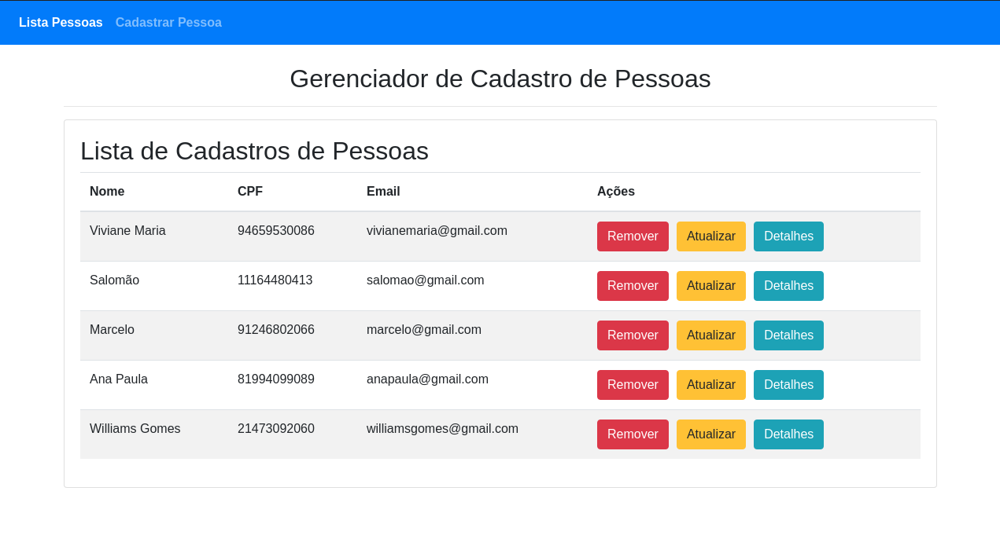
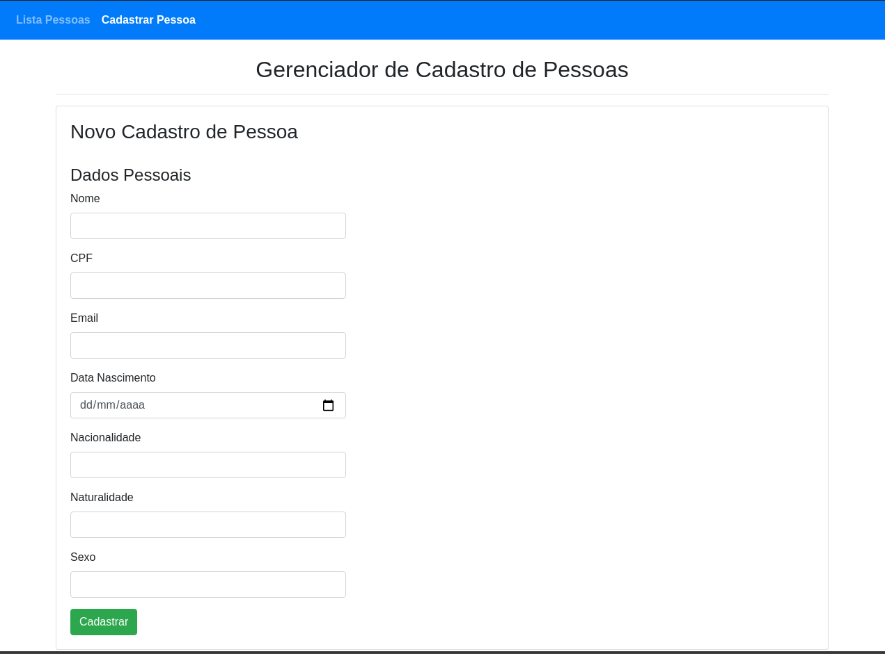
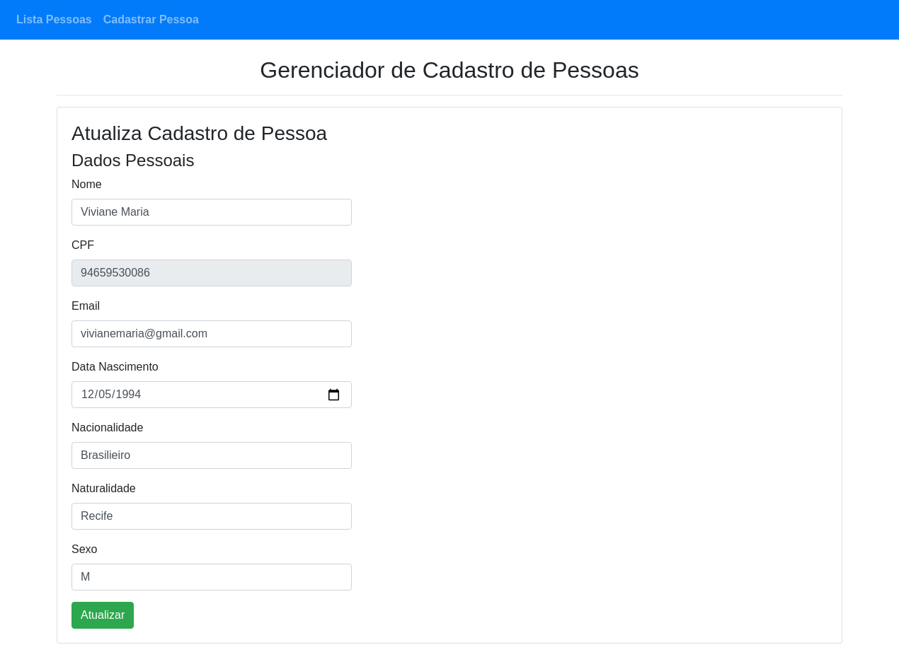
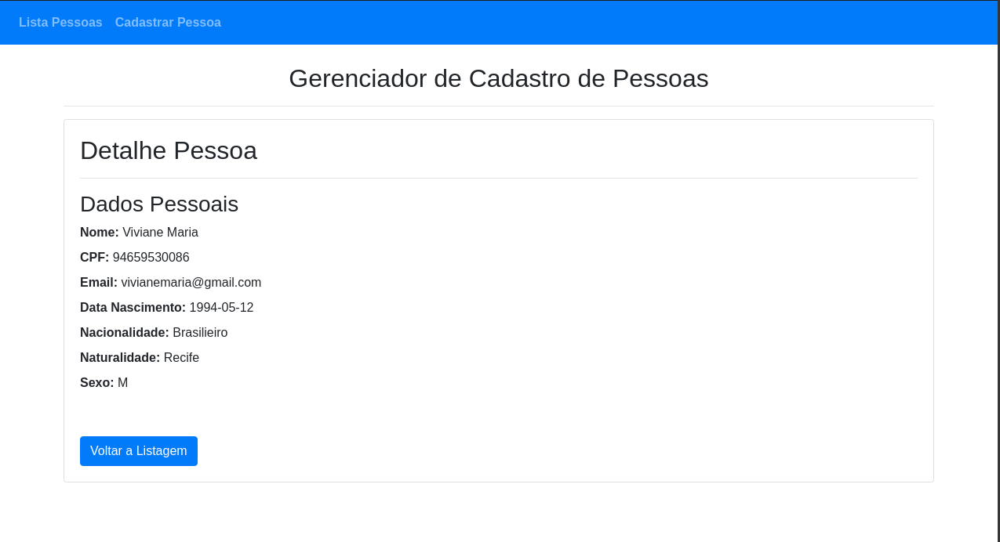
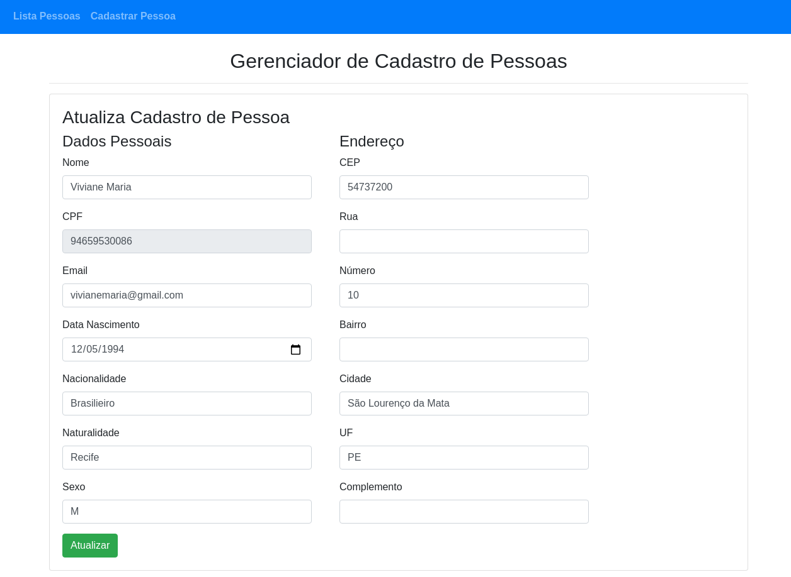
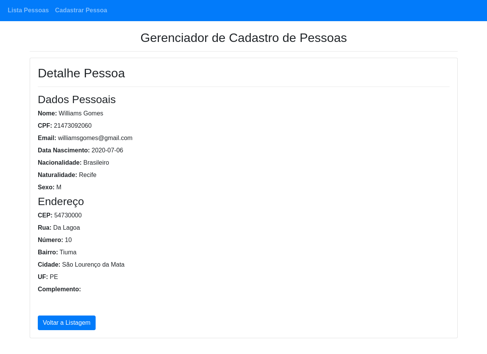

<h1 align="center">
    Gerenciador de Cadastro de Pessoas
</h1>

<h4 align="center">
  <strong>Web Platform</strong>
</h4>

  

  <a href="#floppy_disk-tecnologias">Tecnologias</a>&nbsp;&nbsp;&nbsp;|&nbsp;&nbsp;&nbsp;
  <a href="#computer-projeto">Projeto</a>&nbsp;&nbsp;&nbsp;|&nbsp;&nbsp;&nbsp;
  <a href="#family_man_man_boy_boy-como-contribuir-ou-executar">Como Contribuir</a>&nbsp;&nbsp;&nbsp;|&nbsp;&nbsp;&nbsp;
  <a href="#memo-license">License</a>&nbsp;&nbsp;&nbsp;|&nbsp;&nbsp;&nbsp;
  <a href="#blue_heart-contributors">Colaboradores</a>

 

<strong>People Manager</strong> é um gerenciador de cadastro de pessoas. Podendo adicionar, remover, atualizar e ver o detalhe do cadastro de uma pessoa.

## :floppy_disk: Tecnologias

This project was developed with the following technologies:

<ul>
  <li><a href="https://angular.io/">Angular</a></li>
  <li><a href="https://cli.angular.io/">Angular CLI</a></li>
  <li><a href="https://getbootstrap.com/">Bootstrap</a></li>
</ul>

## :computer: Projeto

Frontend da aplicação Gerenciador de Pessoas

##### 🔢 Comandos

#### **`ng serve`**
> Sobe um servidor de desenvolvimento localmente no endereço http://localhost:4200.

> Para descobrir mais comando do Angular CLI acesse sua documentação [aqui](https://cli.angular.io/)

##### 🔢 Funcionalidades

__Com API V1__
---
`Listagem`

`Cadastro`

`Atualização`

`Detalhe`

`Exclusão`
> Para remover, basta clicar no botão REMOVER na tela de Listagem.

__Com API V2__
---
`Listagem`

`Cadastro`

`Atualização`

`Detalhe`

`Exclusão`
> Para remover, basta clicar no botão REMOVER na tela de Listagem.

## :family_man_man_boy_boy: Como Contribuir ou Executar

Para contribuir e/ou instruções de como rodar a aplicação, <a href="CONTRIBUTING.md">veja nessas instruções</a>.

## :blue_heart: Colaboradores

<table>
  <tr>
    <td align="center" style="border: none;">
      <a href="https://github.com/wwwgomes">
        
         
        
          <b>Williams Gomes</b>
        
      </a>
       
      
<scan title="Code">💻</scan>|<scan title="Documentation">📖</scan>|<scan title="Bugs">🐛</scan>

    </td>
  </tr>
</table>

---
